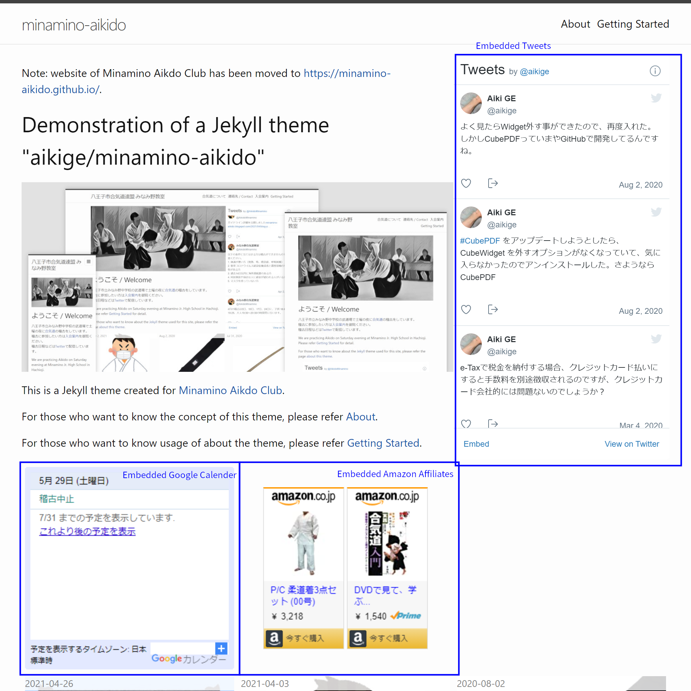
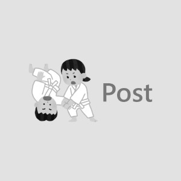

## Quick Start Guide

### A. Simplest way to try the theme - copy contents of test directory

Contents of [test](https://github.com/aikige/minamino-aikido/tree/main/test) directory of the repository will give good example about usage of this theme.

1. Copy contents of [test](https://github.com/aikige/minamino-aikido/tree/main/test) to
   your working directory.
1. Edit index.html and add any message in `_post` directory.
1. If you are going to use GitHub Pages, please just commit to your repository.
   Then, you'll get rendered site.
1. Otherwise, you can try to render the image using [Docker](http://docker.io/).
    1. If you are using Windows and Docker is already installed, please
       just execute `test_remote_theme_on_docker.bat`.
    1. Then Jekyll is executed on the Docker and can access to the rendered site
       http://localhost:4000/

### B. Use theme as remote-theme (recommended)

If you have knowledge of [jekyll-remote-theme](https://github.com/benbalter/jekyll-remote-theme) feature of Jekyll, that is easiest way to try this theme.

Key configuration is:

1. Add `jekyll-remote-theme` to `plugins` setting. For example:

```yml
plugins:
  # ... your plugins.
  - jekyll-remote-theme
```

2. Add `remote_theme` setting into `_config.yml`.

```yml
remote_theme: aikige/minamino-aikido
```

### C. Clone project

Otherwise, please make clone (or fork) of this repository and edit files.

## Usage of Optional Features

This theme contains following optional features:



### Embedded Tweets

If following configuration is exist in `_config.yml`, tweet pain will be shown.

```yml
embed_tweets: yes
twitter_username: aikige
```

The tweet pain shows tweets of a user specified by `twitter_username`.

### Image Width, Caption and Floating

`image.html` provides function to control width, caption and floating for images.

#### Syntax


```

```


All parameters are optional.
- `URL` is recognized as relative URL for source of image.
- `CLASS` is used to control styles, `right`, `left` and `center` is predefined.
  - `right` makes image floated right.
  - `left` makes image floated left.
  - otherwise image is centered.
- `WIDTH` can be used as image width. If not specified, image is rendered with its own size (`width:auto`).


```
{%include image.html url="/assets/img/no_image.jpg"
   description="test" width="100%"%}
```

{%include image.html url="/assets/img/no_image.jpg" description="test" width="100%"%}

<hr class="clear" />


```
{%include image.html url="/assets/img/no_image.jpg"
   description="float right" class="right" width="25%"%}
```

{%include image.html url="/assets/img/no_image.jpg" description="float right" class="right" width="25%"%}

And sample text follows the image...

Text to check behavior or floated text.
Text to check behavior or floated text.
Text to check behavior or floated text.
Text to check behavior or floated text.
Text to check behavior or floated text.
Text to check behavior or floated text.
Text to check behavior or floated text.
Text to check behavior or floated text.
Text to check behavior or floated text.
Text to check behavior or floated text.
Text to check behavior or floated text.
Text to check behavior or floated text.
Text to check behavior or floated text.
Text to check behavior or floated text.
Text to check behavior or floated text.
Text to check behavior or floated text.
Text to check behavior or floated text.
Text to check behavior or floated text.
Text to check behavior or floated text.
Text to check behavior or floated text.

<hr class="clear" />


```

```



And sample text follows the image...

Text to check behavior or floated text.
Text to check behavior or floated text.
Text to check behavior or floated text.
Text to check behavior or floated text.
Text to check behavior or floated text.
Text to check behavior or floated text.
Text to check behavior or floated text.
Text to check behavior or floated text.
Text to check behavior or floated text.
Text to check behavior or floated text.
Text to check behavior or floated text.
Text to check behavior or floated text.
Text to check behavior or floated text.
Text to check behavior or floated text.
Text to check behavior or floated text.
Text to check behavior or floated text.
Text to check behavior or floated text.
Text to check behavior or floated text.
Text to check behavior or floated text.
Text to check behavior or floated text.

<hr class="clear" />
If specified `url` starts with `http:` or `https:` it is recognized as absolute URL and script will not apply `relative_url` filter.



<hr class="clear" />
### Image Floating (old method, not recommended)

This is the CSS trick to align images in markdown document.

1. If you add image with alternative text start by "center", the image will be centered.
1. If you add image with alternative text start by "left", the image will be floated and aligned to left.
1. If you add image with alternative text start by "right", the image will be floated and aligned to right.
1. To clear floating, `<hr class="clear" />` can be used.

Examples:

```markdown
 and sample text follows the image
```

*example of caption*

and sample text follows the image.

<hr class="clear">

```markdown

```
 and sample text follows the image.

Text to check behavior or floated text.
Text to check behavior or floated text.
Text to check behavior or floated text.
Text to check behavior or floated text.
Text to check behavior or floated text.
Text to check behavior or floated text.
Text to check behavior or floated text.
Text to check behavior or floated text.
Text to check behavior or floated text.
Text to check behavior or floated text.
Text to check behavior or floated text.
Text to check behavior or floated text.
Text to check behavior or floated text.
Text to check behavior or floated text.
Text to check behavior or floated text.
Text to check behavior or floated text.
Text to check behavior or floated text.
Text to check behavior or floated text.
Text to check behavior or floated text.
Text to check behavior or floated text.


```markdown

```


and sample text follows the image.

Text to check behavior or floated text.
Text to check behavior or floated text.
Text to check behavior or floated text.
Text to check behavior or floated text.
Text to check behavior or floated text.
Text to check behavior or floated text.
Text to check behavior or floated text.
Text to check behavior or floated text.
Text to check behavior or floated text.
Text to check behavior or floated text.
Text to check behavior or floated text.
Text to check behavior or floated text.
Text to check behavior or floated text.
Text to check behavior or floated text.
Text to check behavior or floated text.
Text to check behavior or floated text.
Text to check behavior or floated text.
Text to check behavior or floated text.
Text to check behavior or floated text.
Text to check behavior or floated text.
